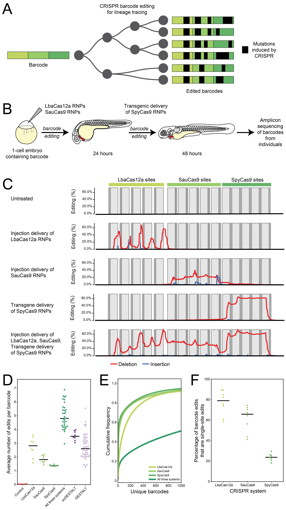

## Orthogonal CRISPR-Cas tools for genome editing, inhibition, and CRISPR recording in zebrafish embryos 
### Paige R. Takasugi, Shengzhou Wang, Kimberly T. Truong, Evan P. Drage, Sahar N. Kanishka, Marissa A. Higbee, Nathan Bamidele, Ogooluwa Ojelabi, Erik J. Sontheimer, James A. Gagnon 

This repository contains all the necessary code and data files to reproduce the following figure, Figure S4, and S5 of the manuscript. 



Below is Figure 4, which exemplifies the potential of our orthogonal CRISPR system for in vivo recording. Parts C-F can be created using this repository. 

**The basic outline is as follows:**
  1. Identify high-quality CRISPR-induced mutations in barcodes by running the GESTALT pipeline (McKenna et al. 2016).
  2. Process outputs of edited barcodes to generate main and supplemental figures. 

**If you want to generate the figures without spending a lot of time and compute for step 1, skip to section [For generating figures using processed data](https://github.com/Gagnon-lab/takasugi-genetics/#For-generating-figures-using-processed-data)**.

## Data pre-processing using GESTALT pipeline 
To call CRISPR-induced mutations, we have adapted the pipeline from https://github.com/aaronmck/Cas9FateMapping. Briefly, this takes raw sequencing data, merges paired reads, aligns resulting consensus sequences to the reference, and generates output files for further processing and downstream analysis. 

To generate processed outputs from sequencing data, first download the raw FASTQ files from GEO accession number [GSE186338](https://www.ncbi.nlm.nih.gov/geo/query/acc.cgi?acc=GSE186338).

We recommend running this pipeline on a high-performance computing cluster as it will require quite a bit of memory (and time) to execute. 
Although most of the instructions can be found [here](https://github.com/mckennalab/SingleCellLineage), we briefly outline the instructions to get started on a HPC. One may need to adapt these instructions according to the specifications of your HPC. 

**Dependency required**
* Docker-like container 

First, download the Docker container. The Center for High Performance Computing (CHPC) at the University of Utah offers Singularity as a container alternative, and one can download the container as a Singularity image like so: 

```
singularity build GESTALT.sif docker://aaronmck/genomics:sc_GESTALT 
```

The rest of the files needed to run the pipeline can be mostly found in `pipeline/` and are as follows:
1. `barcode.referenceseq.fa`: fasta file containing the barcode sequence including
2. `barcode.referenceseq.fa.primers`: primer sequences expected to be on both ends of the amplicon for sequencing, one on each line. 
3. `barcode.referenceseq.fa.cutSites`: tab-delimited file with three columns; the first indicates the sequence of the CRISPR target, the second is the start position (5') of that target, and the third is the position of the predicted cutsite depending on the Cas system. 
4. `gestalt_pipeline_no_trees.scala`: pipeline script that is dependent on the GATK Queue processing engine 
5. `embryo-samples.tearsheet.txt`: tearsheet listing all the samples to create compute jobs for the Queue manager 
6. `run_gestalt_pipeline.sh`: shell script to execute the pipeline with input samples provided in the tearsheet
7. Depending on whatever is used as a job management system on your cluster, one needs to provide a SLURM-like script that at a minimum does the following: 
```
# makes the output folder to dump outputs
mkdir -p OUTPUT

# executes the pipeline after mounting the data/pipeline files into the container 
singularity -exec --bind $DATA_DIR:/my_data GESTALT.sif /my_data/run_gestalt_pipeline.sh
```

You should copy all the above files and FASTQs into your `$DATA_DIR`. 

## For generating figures using processed data
If step 1 is done successfully, the pipeline would have created a number of files in an output directory for each sample within `OUTPUT/`. For most of the CRISPR recording analysis, we used the `.allReadCounts` files outputted from the pipeline to compare barcodes between different embryos. **I've included these files in the `data/readcounts_files/` directory, but one could also download it from [GEO](https://www.ncbi.nlm.nih.gov/geo/query/acc.cgi?acc=GSE186338) as well.**

The pipeline will also generate visualization output necessary to make plots such as **Figure 4C** and all the plots in **Figure S5**. The files can be found within the *var/www/html* directory.

Within `var/www/html`, each sample will have its own folder as follows:
```
var/www/html
  |_viz-Output
    |_Lba1
      |_Lba1.perBase 
      |_Lba1.topReadEventsNew 
      |_Lba1.topReadCounts 
      |_read_editing_mutlihistogram.html
      |_read_editing_mutlihistogram.js
      |_barcode.referenceseq.fa.cutSites 
      |_Lba1.allReadCounts 
      |_JS_files.js
    |_...
```

```
# enter the directory for sample Lba1
cd Lba1/ 

# open up a local server on your computer
python -m http.server 8080
```

This will produce the barcode edit plot for "Injection delivery of LbaCas12a RNPs" in **Figure 4C** and can be done for any of the other samples. 

Commands for reproducing the other figures are as follows: 

#### **Figure 4D**: `python swarmplot.py`
This produces a beeswarm plot of the average number of edits per barcode under various CRISPR systems including previous versions of GESTALT. This relies on previously published datasets which are included in the `data/` directory. 

#### **Figure 4E**: `python plotCDF.py` 
Produces the cumulative density of barcodes within a representative embryo for each CRISPR system. 

#### **Figure 4F**: `python percentIndels.py` 
Produces a beeswarm showing the average rate of single-site edits in a barcode within a sample under each CRISPR system. 

#### **Figure S5**: `python cosim-heatmap.py`
Produces a heatmap of barcode similarity between different embryos based on the cosine similarity metric. Depending on which samples you want to compare, you need to set the `samples` variable in the script to one of the assigned list variables. For example, if you want to compare all SpyCas9-edited embryos based on cosine similarity, simply set `samples` to `Spy_edited`. **Note**: Generating the heatmap in Figure S5E (for `All_edited`) does take about ~5 hours. 


